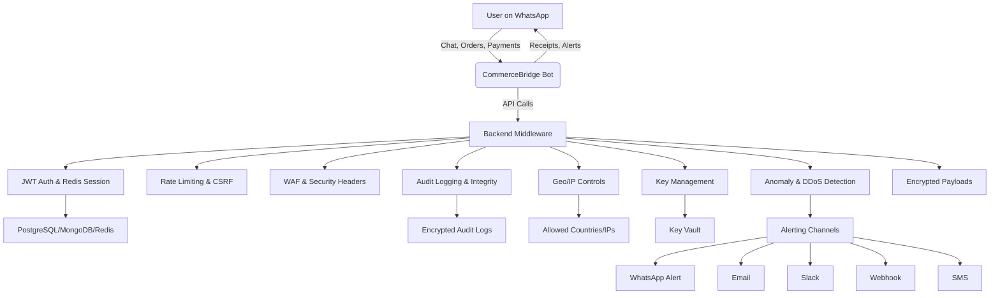

# 🛡️ Security & Compliance: Why CommerceBridge is Strong

CommerceBridge is designed from the ground up with security, privacy, and operational resilience as top priorities. Here’s how we keep your data, transactions, and users safe:

## 1. Modern Authentication & Session Security
- **JWT with Refresh Tokens:** Secure, stateless authentication using short-lived access tokens and long-lived refresh tokens, with rotation and revocation support.
- **Redis-Backed Sessions:** Session data and refresh tokens are stored in Redis for fast, secure, and scalable session management.
- **Secure Cookies:** All authentication cookies are set with `HttpOnly`, `Secure`, and `SameSite=Strict` flags to prevent XSS and CSRF attacks.

## 2. Defense-in-Depth Middleware
- **Rate Limiting & Brute-Force Protection:** Global, per-user, and per-endpoint rate limits, plus brute-force login attempt blocking, to stop abuse and credential stuffing.
- **CSRF Protection:** Robust CSRF middleware for all state-changing endpoints.
- **Security Headers:** HTTP headers set via Helmet to block common web vulnerabilities.
- **Web Application Firewall (WAF):** Input sanitization and attack pattern detection at the middleware layer.

## 3. Audit Logging & Integrity
- **Encrypted Audit Logs:** All critical actions and security events are logged and encrypted using strong cryptography (libsodium).
- **File Integrity Monitoring:** Automatic hashing and verification of key files and directories to detect tampering.
- **Automated Backups:** Secure, scheduled backups with integrity checks and encrypted storage.

## 4. Network & API Security
- **Geo-Blocking & IP Whitelisting:** Restrict access to trusted countries and dynamically managed IP allowlists.
- **HMAC Request Signing:** All sensitive API requests are signed and verified using HMAC for authenticity.
- **API Key Validation:** Fine-grained API key management for third-party integrations.
- **Mutual TLS (mTLS) Simulation:** Optional client certificate validation for high-trust integrations.

## 5. Key Management & Encryption
- **Key Rotation:** Automated, scheduled rotation of encryption and signing keys, with secure key history and revocation.
- **End-to-End Encryption:** Sensitive data and transactions are encrypted in transit and at rest.
- **Encrypted Payloads:** Optional payload encryption for highly sensitive operations.

## 6. Threat Detection & Resilience
- **Anomaly & DDoS Detection:** Real-time monitoring for suspicious request patterns and high-frequency attacks, with automated blocking and alerting.
- **Runtime Application Self-Protection (RASP):** In-process monitoring for memory, latency, and runtime anomalies.
- **Comprehensive Error Handling:** Structured error responses, retry logic, and user-friendly error messages.

## 7. Alerting & Monitoring
- **Multi-Channel Alerting:** Security and operational events can trigger alerts via WhatsApp, email, Slack, webhooks, or SMS.
- **Health Checks & Monitoring:** Built-in health endpoints and system metrics for proactive monitoring.
- **Audit & Compliance Reporting:** All security events are logged for compliance and review.

## 8. Privacy & Compliance
- **Data Privacy Controls:** User data is protected with strict access controls and privacy-by-design principles.
- **Verified Business Badges:** Only trusted, verified sellers are allowed, building user trust.
- **Regular Security Audits:** Codebase and infrastructure are regularly reviewed for vulnerabilities.

---

## 🗺️ Security Architecture Diagram

---

**CommerceBridge is not just feature-rich—it’s built to be resilient, trustworthy, and secure for modern e-commerce on WhatsApp.** 